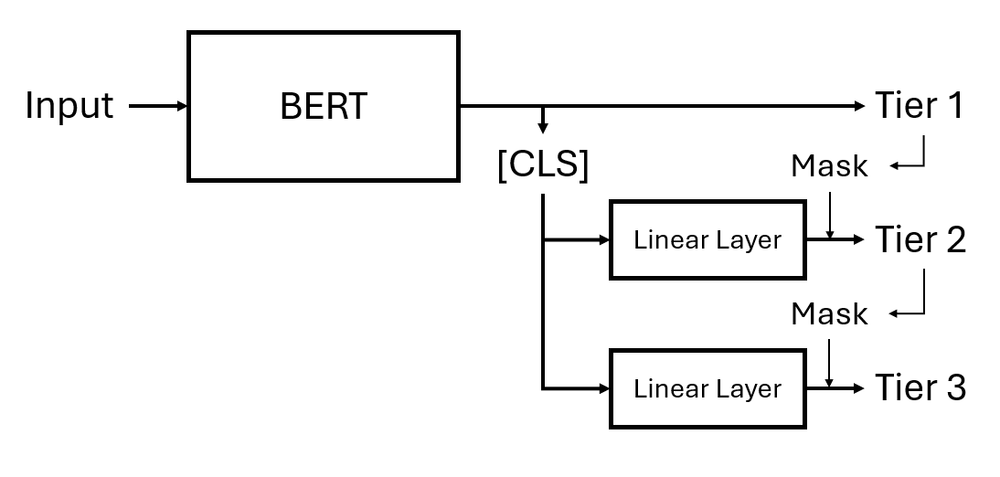

# Hierarchical Text Classification with BERT

An approach to hierarchical text classification using BERT-based models. It explicitly limits the classes that can be predicted for lower tiers by masking the logit outputs of the prediction layer with a binary vector designating the dependencies between different levels of the hierarchy.

Based on a project for the course L665 - Applying Machine Learning Techniques in Computational Linguistics at Indiana University Bloomington.
Because the original implementation used a dataset that is not yet publicly availaible, this model was trained on the [Blurb Genre Collection](https://www.inf.uni-hamburg.de/en/inst/ab/lt/resources/data/blurb-genre-collection.html) dataset.

## Running

- requirements
- run train.py

## Dataset
The Blurb Genre Collection is a dataset consisting of over 60,000 book blurbs from [Penguin Random House](penguinrandomhouse.com) compiled and maintained by the Language Technology Group at the University of Hamburg.
Each book is assigned at least one category, which are hierarchical in nature. For instance, the 'Fiction' category has several subcategories, such as 'Science Fiction', which has subcategories of its own in the form of 'Cyber Punk', 'Military Science Fiction', and 'Space Opera'.
In total, there are a total of four tiers of categories. Since only a small subset of data points are assigned a tier 4 category, which greatly limits the interpretability of performance metrics, only the first three tiers were included here.
The first tier contains 7 categories, the second 44, and the third 74.

## Architecture

The model employed here builds on and extends the basic BERT transformer in two key ways: 
First, it adds further prediction heads for each tier within the category hierarchy.
Second, the categories that can be predicted for the lower tiers are explicitly limited based on the predicition for the previous tier by masking the model's outputs with a binary one-dimensional array which designates the subcategories for the previous tier.
For instance, given a hypothetical class hierarchy where Tier 1 = {*a, b*} and Tier 2 = {*c, d, e, f*}, such that {*c, d*} are subcatogories of *a* and {*e, f*} subcategories of *b*, if the model predicts *a* for Tier 1, the mask would take the form of [1,1,0,0], where each element corresponds to a Tier 2 category.
In this case, the mask communicates that {*c, d*} are valid categories for Tier 2, but {*e, f*} are not.
The mask array is then multiplied with the logit output of the Tier 2 prediction head.
Because invalid categories are represented by zeros, their product will likewise be zero, meaning that the relevant category cannot be predicted.
This process is then repeated for all tiers within the hierarchy.

## Methodology
This implementation used the base RoBERTa model due to its high performance on fine-tuning task in experimentation and the literature.
(RoBERTa-large showed no noticeable increase in performance over the base model, on top of being much slower to train.)
The model was first fine-tuned on the tier 1 categories for three epochs, and then on all tiers for another three epochs.

Training and evaluation were performed using the [Hugging Face Trainer API](https://huggingface.co/docs/transformers/main_classes/trainer) using the default parameters.
The model was evaluated based on accuracy and F1-score for each tier. Predictions for tiers 2 and 3 were further evaluated based on conditional accuracy, i.e., the percentage of correct predictions for the current tier given that the category for the previous tier was predicted correctly.

## Results

The following table shows the model's performance on the test set.

|            | **Accuracy (Absolute)** | **Accuracy (Conditional)** | **F1-Score** |
|------------|-------------------------|-------------------------|--------------|
| **Tier 1** | 92.73%                  | N/A                     | 0.82         |
| **Tier 2** | 74.79%                  | 78.87%                  | 0.57         |
| **Tier 3** | 75.71%                  | 81.33%                  | 0.48         |
